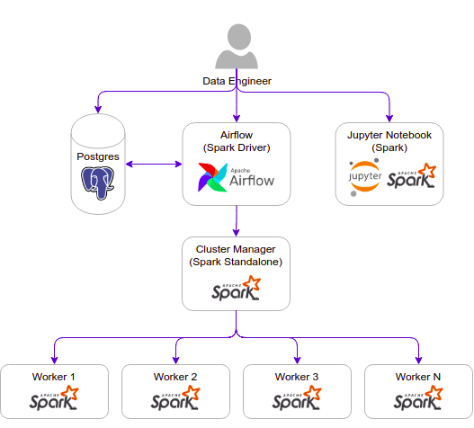
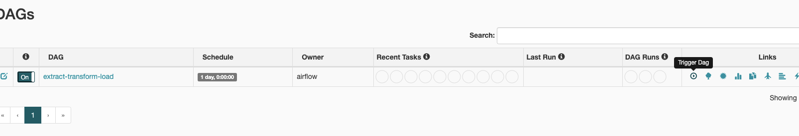

## ETL example pipeline 

####The architecture of this project is inspired by: https://github.com/cordon-thiago/airflow-spark 

This project contains the following containers:

* postgres: Postgres database for Airflow metadata and a Test table used as our storage for the task.
    * Image: postgres:9.6
    * Database Port: 5432
    * References: https://hub.docker.com/_/postgres

* airflow-webserver: Airflow webserver and Scheduler.
    * Image: docker-airflow-spark:1.10.7_3.1.2
    * Port: 8282

* spark: Spark Master.
    * Image: bitnami/spark:3.1.2
    * Port: 8181
    * References: 
      * https://github.com/bitnami/bitnami-docker-spark
      * https://hub.docker.com/r/bitnami/spark/tags/?page=1&ordering=last_updated

* spark-worker-N: Spark workers. You can add workers copying the containers and changing the container name inside the docker-compose.yml file.
    * Image: bitnami/spark:3.1.2
    * References: 
      * https://github.com/bitnami/bitnami-docker-spark
      * https://hub.docker.com/r/bitnami/spark/tags/?page=1&ordering=last_updated

* jupyter-spark: Jupyter notebook with pyspark for interactive development.
  * Image: jupyter/pyspark-notebook:spark-3.1.2
  * Port: 8888
  * References: 
    * https://hub.docker.com/layers/jupyter/pyspark-notebook/spark-3.1.2/images/sha256-37398efc9e51f868e0e1fde8e93df67bae0f9c77d3d3ce7fe3830faeb47afe4d?context=explore
    * https://jupyter-docker-stacks.readthedocs.io/en/latest/using/selecting.html#jupyter-pyspark-notebook
    * https://hub.docker.com/r/jupyter/pyspark-notebook/tags/

## Architecture components

I ve edited airflow.cfg to use Local Executor to achieve parallelism running the tasks/processes. 

## Setup

### Start containers

Navigate to `airflow-etl/docker` and:

    $ docker-compose up

If you want to run in background:

    $ docker-compose up -d

**NOTE**: When running the above for the first time make sure the `init-user-db.sh` is executable first by going to dir `docker/docker-airflow/pg-init-scripts` and execute:

    $ chmod +x init-user-db.sh 

Otherwise the docker-compose might not successfully finish postgres being stuck in the volumes step (see `docker-compose.yml`) 

### Check if you can access

Airflow: http://localhost:8282

Spark Master: http://localhost:8181

PostgreSql - Database Test:

* Server: localhost:5432
* Database: test
* User: test
* Password: postgres

Postgres - Database airflow:

* Server: localhost:5432
* Database: airflow
* User: airflow
* Password: airflow

Jupyter Notebook: http://127.0.0.1:8888
  * For Jupyter notebook, you must copy the URL with the token generated when the container is started and paste in your browser. The URL with the token can be copied from container logs, can be found in:
  
        $ docker logs -f docker_jupyter-spark_1

In the `notebooks/extract-transform-notebook.ipynb` you can find the functions used to solve the transformations required in the task.   
  
## Running the dag

1. Configure spark connection accessing airflow web UI http://localhost:8282 and going to Admin -> Connections
   

2. Edit the `spark_default` connection inserting `spark://spark` in Host field and Port `7077` and `save`
    

3. Go to dags and run and trigger the `extract-transform-load` dag (click trigger button)
    

## Task 3: Write an SQL query for the following :
a. Which channel is most popular per region (Hint: use watch duration)

    SELECT channel, sum(duration) total_duration FROM processed_users GROUP BY channel, regionid HAVING MAX(total_duration)

b. Which user is the most active user.

    SELECT user_id, SUM(duration) total_watch FROM processed_users GROUP BY user_id ORDER BY total_watch DESC LIMIT 1  

-----------------------

